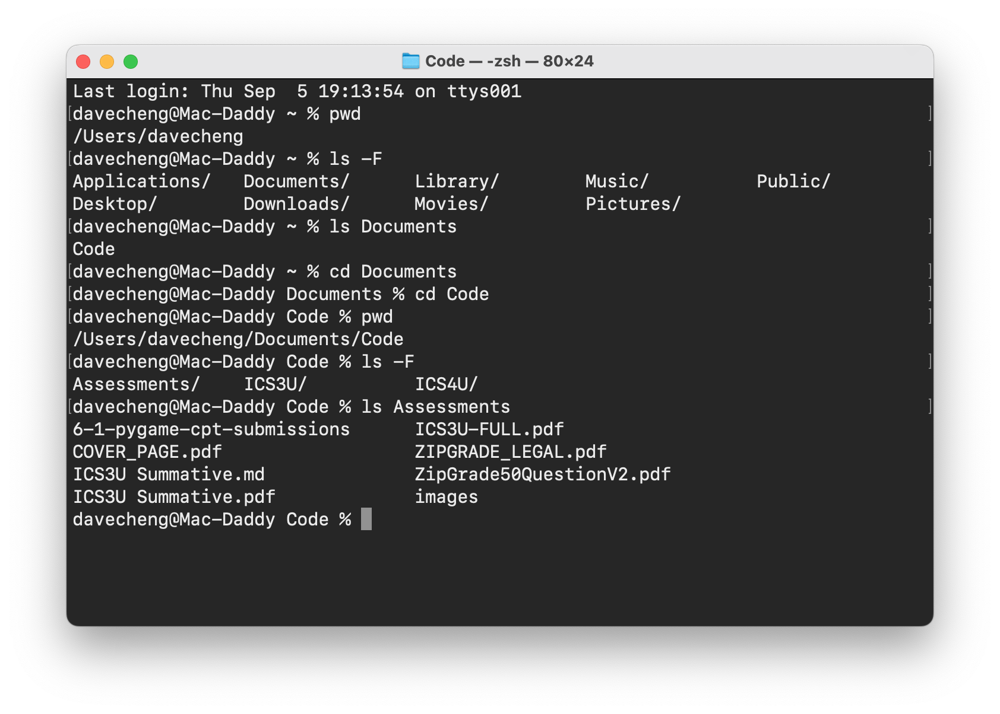
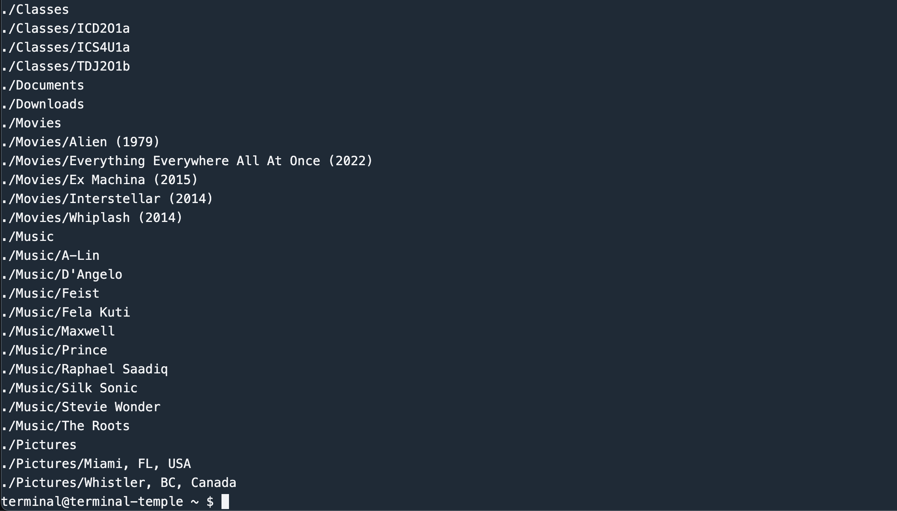
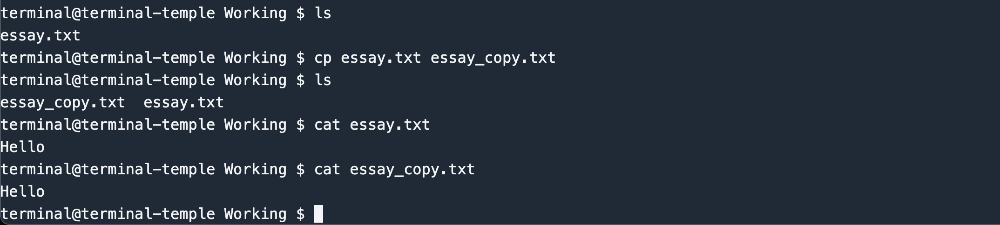
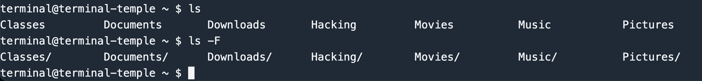
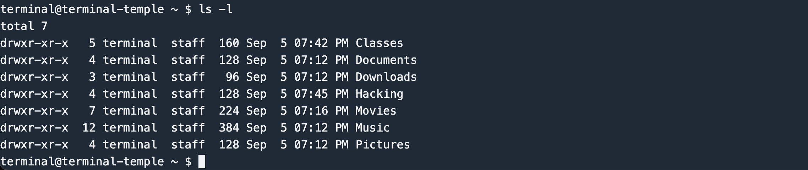
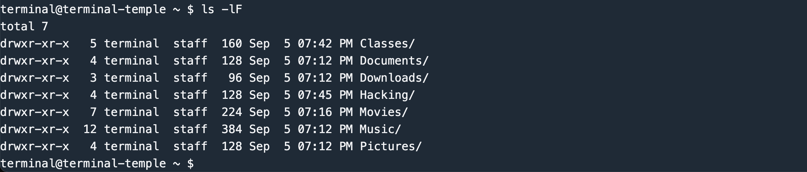
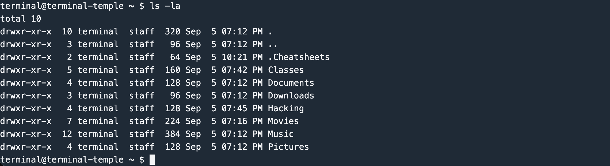

# Command Line Interface
The command line interface (or CLI) is an important tool for programmers to learn. The text-only interactions can be somewhat obtuse to new users, but it offers many advantages, including:

### Efficiency and Automation
The CLI allows faster execution of tasks and enables automation through scripting, saving time and increasing productivity.

### Remote Development & Server Management
Many servers and remote environments rely solely on the CLI, making it essential for managing systems without graphical user interfaces.

### Access to Powerful Tools
The CLI provides access to robust tools and utilities (e.g., Git, compilers, text processing tools) that are crucial for development, debugging, and system management.



## Part 1: Tutorial
Complete this interactive tutorial at [Terminal Tutor](https://www.terminaltutor.com/). 

The tutorial has two chapters, *Interacting with the terminal* and *Navigating directories*. Don't worry about the 1+ hour completion time estimate. It is likely you will finish the tutorial much quicker.

### Critical Note: Missing `Tab` Auto-Complete
This CLI simulation is missing the ability to press the `Tab` key to auto-complete directory and file names. In practice, `Tab` auto-completion is one of the most helpful shortcuts when working with CLIs, saving time and ensuring accuracy of spelling. Sorry!

## Part 2: Practice Session
Once you've completed the tutorial, practice what you've learned by traversing a directory tree and looking for files to copy, delete, and create. 

Follow these step-by-step directions. When you are finished, submit the entire text output of your practice session in the file [`TerminalSessionLog.txt`](TerminalSessionLog.txt) of this repo.

### Part 2A: Navigating & Creating Directories
1. Click [this link](https://www.terminaltemple.com/) to open a terminal practice session in your browser. 
1. Display the path of the working directory.
1. List the contents of the home directory.
1. Create a folder in the home directory called `Classes`. The absolute path of this folder should be `/home/terminal/Classes`.
1. Within the `Classes` folder, create a new folder with the course code of each class you are taking this semester.
1. Navigate to the `Music` folder.
1. Within the `Music` folder, create 10 folders, each with the name of a musical artist you like.
1. Navigate to the `Pictures` folder.
1. Within the `Pictures` folder, create 2 folders, each with the name of a place that you have visited.
1. Navigate to the `Movies` folder.
1. Within the `Movies` folder, create 5 folders, each with the name of a film that you like. The format of these folders should be `Movie Title (####)` where `####` represents the release year of the film. For example, `Dune: Part Two (2024)` or `Turning Red (2022)`.

After Part 2A, your directory tree might look something like this:



### Part 2B: Finding Secrets
1. Carefully search the directory tree. Look for the user's *plan for world domination*. Print or output this text file to the terminal session with the `cat` command, e.g. `cat filename-to-display.txt`.
1. This user has a secret key for their Bitcoin crypto-currency wallet [hidden](#finding-hidden-files) somewhere. Find the secret key and output it to the terminal session with the `cat` commmand. (HINT: The file will begin with the text `BEGIN PGP PUBLIC KEY BLOCK` and look like a bunch of random letters and numbers.)
1. Locate the user's *biggest secret*, likely also [hidden](#finding-hidden-files) somewhere. Output the text of this to the terminal, again using the `cat` command.
1. Create a folder in the home directory called `Hacking`. The absolute path of this folder should be `/home/terminal/Hacking`.
1. Copy the *crypto-currency secret key* file to a file called `money.txt`, saved into the `Hacking` folder.
1. Copy the user's *biggest secret* file a file called `blackmail.txt`, saved into the `Hacking` folder.
1. As the last task in your terminal session, run the command `find ~/` to display all folders and sub-folders of the user's home directory.

### Part 2C: Logging
1. Copy the entire contents of your terminal practice session, Part 2A and 2B. Paste this log into the file [`TerminalSessionLog.txt`](TerminalSessionLog.txt).
1. Commit the change and push your work to GitHub to finish.


## Tips & Tricks
### Displaying Files
The `cat` command outputs or prints the contents of a file to the screen.

### Copying Files
The `cp` command can be used `cp <source> <target>` to copy a path/file at `<source>` to the new copy at `<target>`.

For example, this sequence of commands creates a copy of the `essay.txt` file, and uses `cat` to output both, showing they are identical:



### Handling Spaces
To specify names with spaces, enclose the name in quotation marks, or escape the space character with a preceding backslash `\`. For example:

```
mkdir "The Roots"
```
or
```
cd ~/Music/Stevie\ Wonder
```

### Getting More from `ls`
The command `ls` lists the contents of a directory, but the command can also be modified to affect how this is displayed. For example, you have learned that `ls -F` indicates which names are directories or folders with a trailing `/` character:



The option `-l` shows the information in a long form, including date stamps:



You can also combine options, such as `-lF`:



### Finding Hidden Files
In Linux and UNIX, files and folders can be hidden by placing a `.` character at the beginning of the filename. Hidden files do not show up with simple `ls` commands, however, they are visible with the `-a` option:



You can see the hidden folder `.Cheatsheets` is now visible. You can change into this directory by typing the command `cd ~/.Cheatsheets` or `cd .Cheatsheets`.

## Assessment Criteria
- **4 points**: All steps (2A, 2B, 2C) are followed accurately. Terminal session is logged in its entirety.
- **3 points**: Most steps are followed. Terminal session is logged.
- **2 points**: Some steps are followed. Terminal session is logged.
- **1 point**: Few steps are followed or some of terminal session log is missing.
